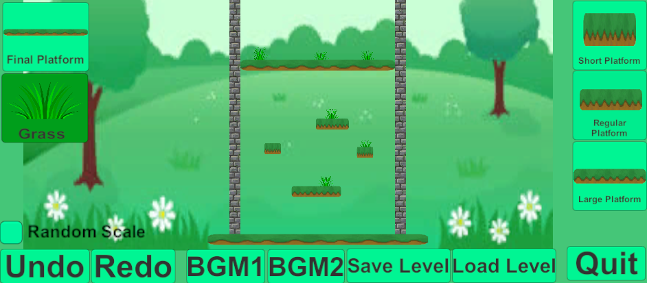

# Game Engines A2

### DESCRIPTION:	
In this game you will attempt to climb up a tower of grass platforms by jumping up.

Be careful! The ground is very slippery and the walls are very bouncy so it is difficult to control your movements.

For this assignment, we decided on doing Option C. This level editor allows the player to place a variety of platforms, grass and to change background music to one of two tracks you may like. The level editor also includes and undo and redo options just in case you misplace an object as well as a toggle to randomize the scale of each of the platforms giving the game more challenge!

### SCREENSHOTS:

### UML:

LINKS:

Demo Video Link:

[LINKHERE]

Team:
- Aiden Gimpel - 100740094
- Tyler Wong - 100750805

### REFERENCES:
We got our textures from these sources:

- OpenGameArt.org
- PNGTree.com
- Freesvg.org

Background Music and Sound Effects:

https://www.youtube.com/watch?v=isGaq0fvCCI
https://www.youtube.com/watch?v=k1cx-JdyxbY
https://www.soundfishing.eu/

We watched these videos for assistance:

https://www.youtube.com/watch?v=FGVkio4bnPQ
https://www.youtube.com/watch?v=R6scxu1BHhs&t=659s

We used these Webpages:

https://refactoring.guru/design-patterns/factory-method
https://answers.unity.com/questions/827834/click-and-drag-camera.html
https://answers.unity.com/questions/783279/46-ui-how-to-detect-mouse-over-on-button.html

We used these previous assignments: 

- Game Engine Assignment 1 (For the base project and assets)
- Game Engine Midterm Quiz (For DLL Plugin)
- Game Engine Lab 4 (For DLL implementation in Unity)
- Game Engine Lab 5 (For command and observer game design pattern)
